**Modul 1**

**SCM: Git dan GitHub**

**LATIHAN**

Instalasi GIT di windows

Sebelum install Git di Windows, anda harus sudah mempunyai editor teks yang didukung oleh Windws. Editor yang bisa dipilih banyak, tetapi disarankan menggunakan Notepad++ atau Visual Studion Code atau Vim. 

1.Setelah selesai mendownload Git, lalu double click pada file yang telah di download. Kemudian muncul lisensi. Klik next untuk melanjutkan

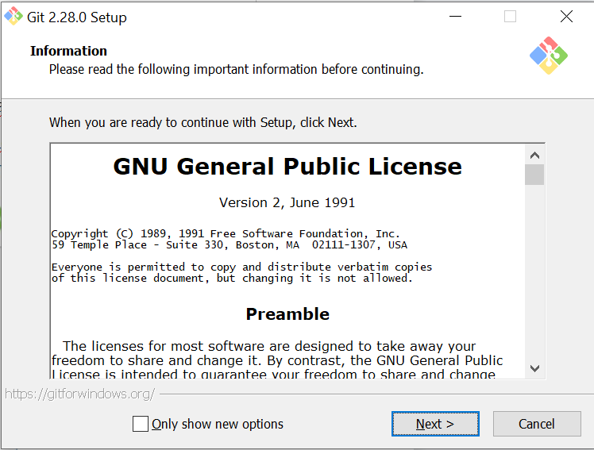

2.Setelah itu, pilih lokasi instalasi. Secara default akan terisi C:\Program Files\Git. Ganti lokasi jika memang anda menginginkan lokasi lain, klik Next

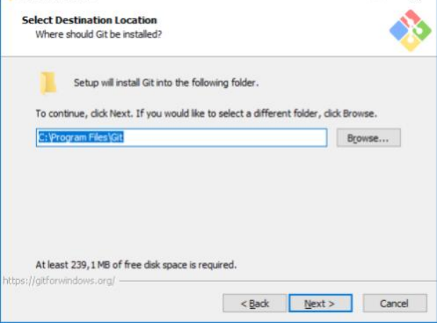

3.Pilih komponen. Tidak perlu diubah-ubah, sesuai dengan default saja. Klik pada Next.

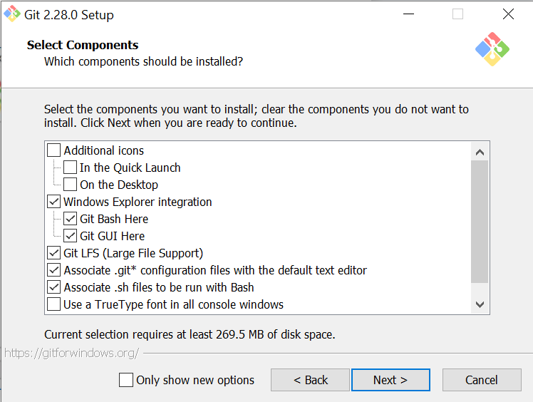

4.Mengisi shortcut untuk menu Start. Gunakan default (Git), ganti jika ingin mengganti - misalnya Git VCS.

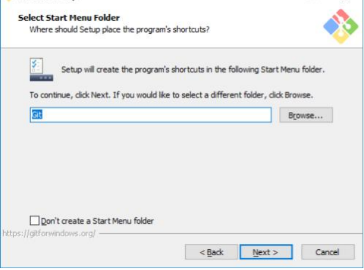

5.Pilih editor yang akan digunakan bersama dengan Git. Pada pilihan ini, digunakan Notepad++.

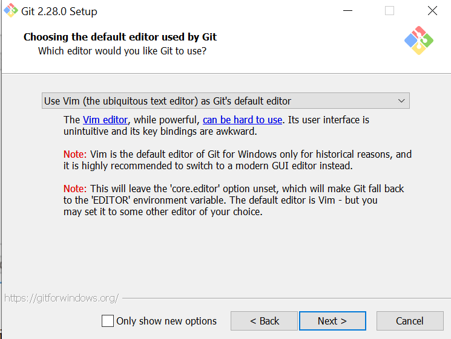

6.Pada saat instalasi, Git menyediakan akses git melalui Bash maupun command prompt. Pilih pilihan kedua supaya bisa menggunakan dari dua antarmuka tersebut. Bash adalah shell di Linux. Dengan menggunakan bash di Windows, pekerjaan di command line Windows bisa dilakukan menggunakan bash - termasuk ekskusi dari Git.

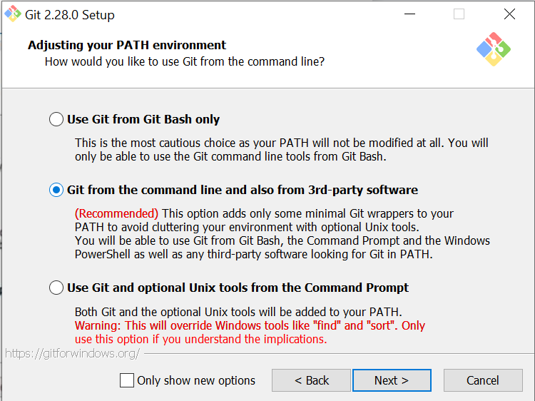

7.Pilih OpenSSL untuk HTTPS. Git menggunakan https untuk akes ke repo GitHub atau repo-repo lain (GitLab, Assembla).

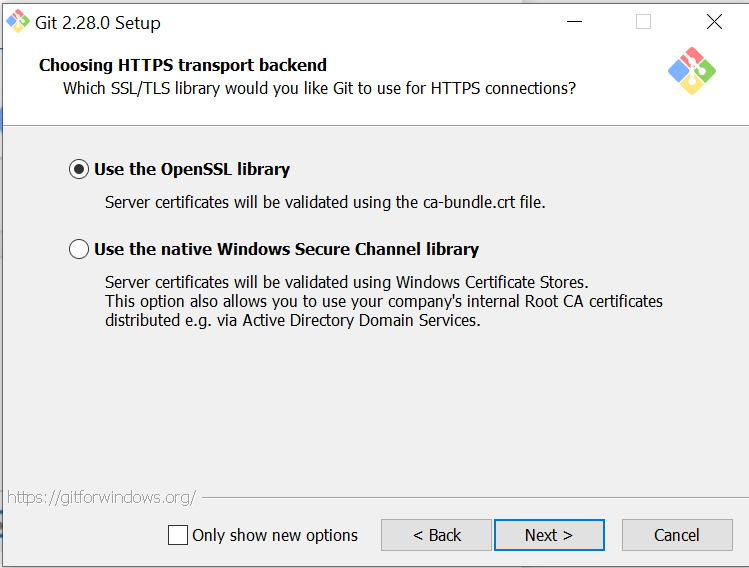

8.Pilih pilihan pertama untuk konversi akhir baris (CR-LF).

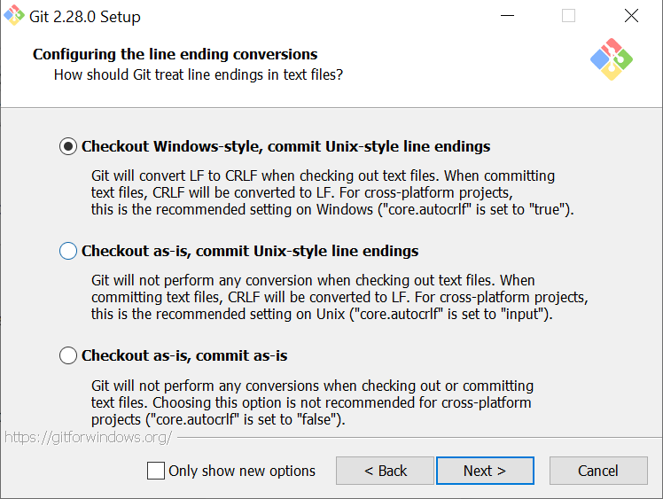

9.Pilih PuTTY untuk terminal yang digunakan untuk mengakses Git Bash.

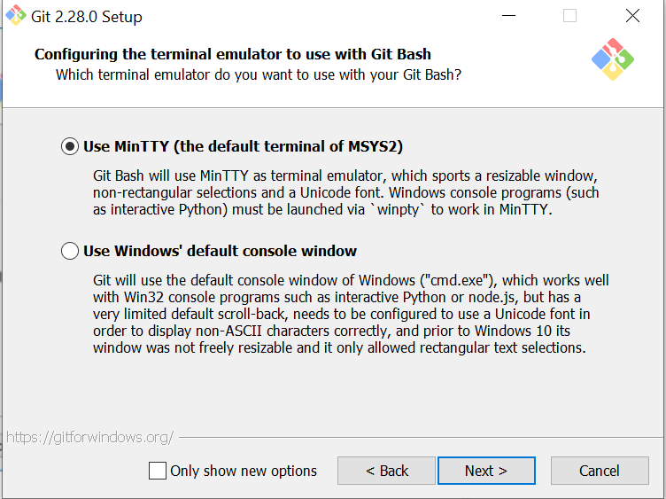

10.Untuk opsi ekstra, pilih yang bagian atas.

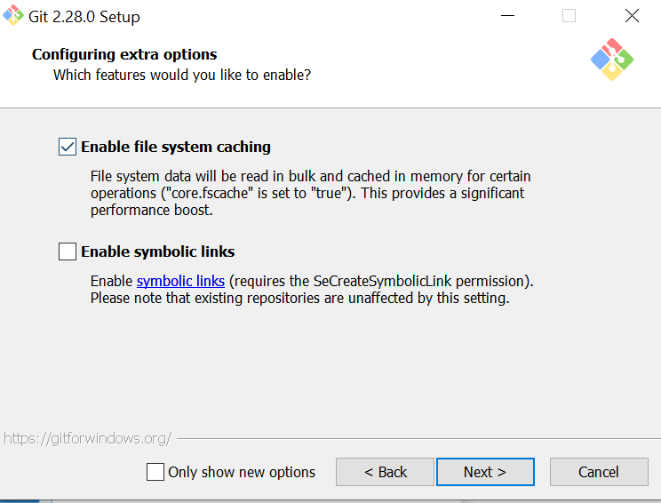

11.Pilih default untuk git pull, pilih yang default

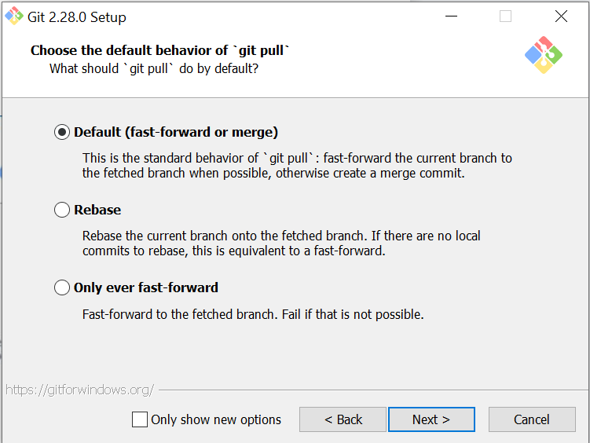

12.Pilih bantuan mandat, pilih Git credential Manager

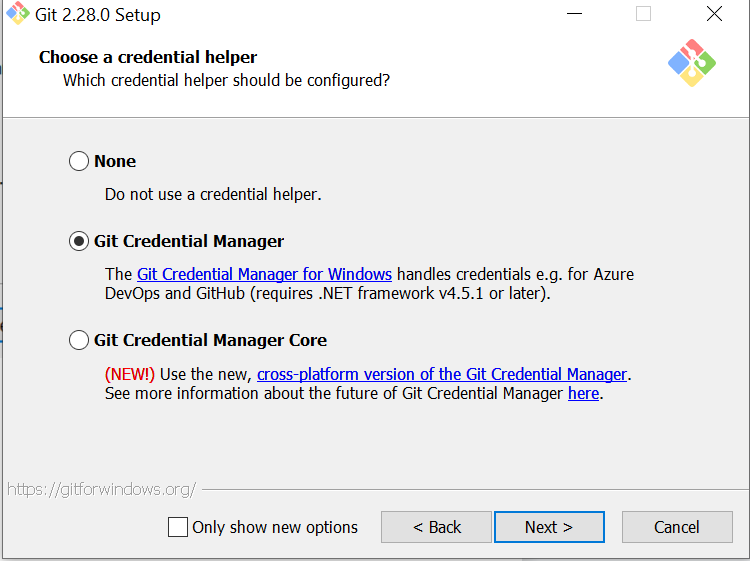

13.Uncheck opsi konfigurasi experimental

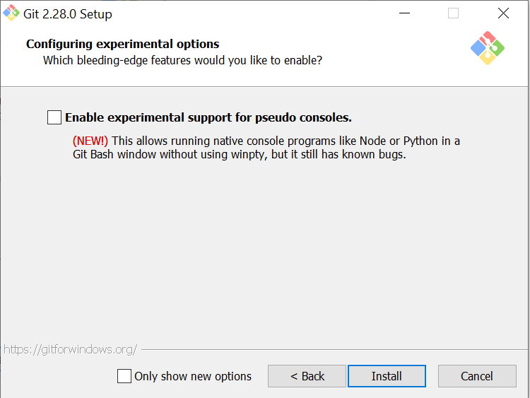

14.Setelah itu proses instalasi akan dilakukan.

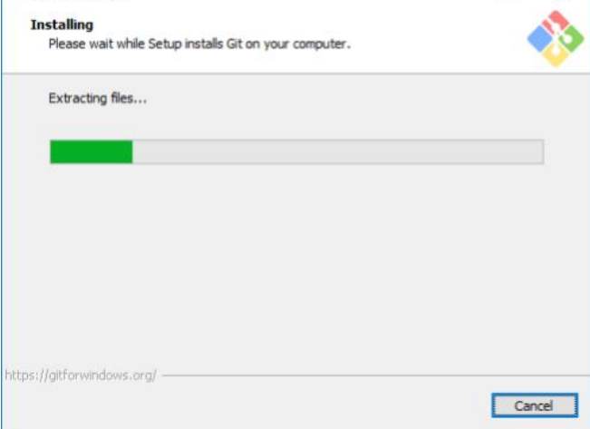

15.Jika selesai akan muncul dialog pemberitahuan. Klik pada Finish.

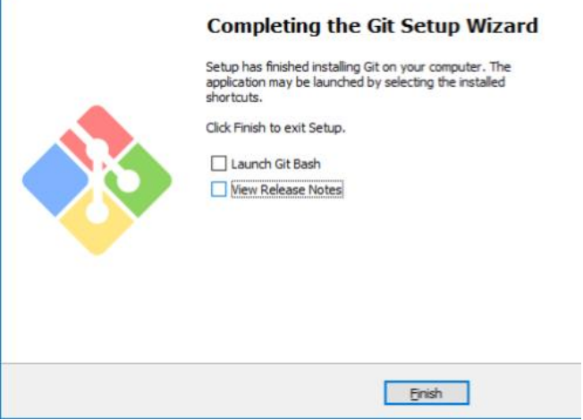

16.Untuk menjalankan, dari Start menu, ketikkan "Git", akan muncul beberapa pilihan. Pilih "Git Bash" atau "Git GUI".

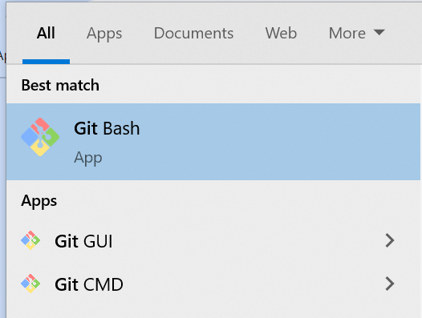

17.Tampilan jika akan menggunakan "Git Bash"

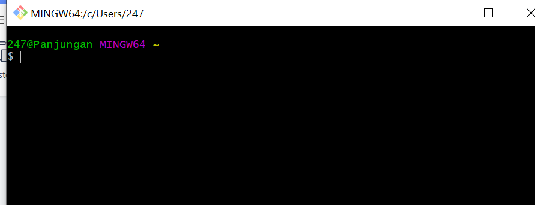

18.Tampilan jika akan menggunakan "Git GUI"

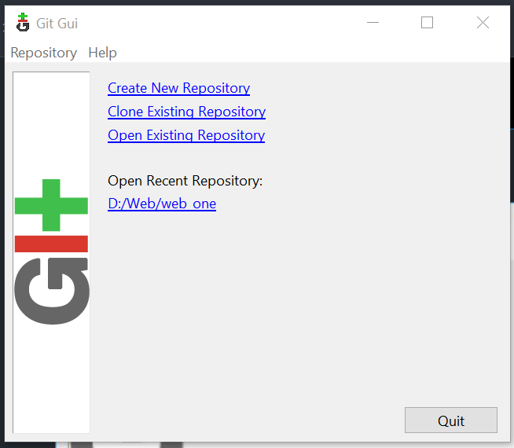

19.Untuk mencoba dari command prompt, masuk ke command prompt, setelah itu eksekusi "git --version" untuk melihat apakah sudah terinstall atau belum. Jika sudah terinstall dengan benar, makan akan muncul hasil berikut:

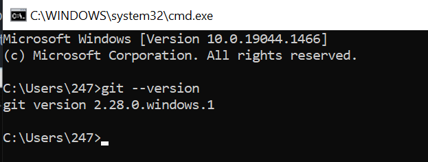

Konfigurasi GIT

Secara minimal, user harus memberitahu Git tentang username serta email yang digunakan setiap kali terjadi perubahan pada repo Git. Username serta email ini yang akan dimasukkan oleh Git ke catatan perubahan di repo. Di sistem operasi Linux atau sejanis (UNIX), konfigurasi ini nantinya akan disimpan di $HOME/.gitconfig. Untuk sistem operasi Windows, konfigurasi ini akan disimpan di C:\Document and Settings\NamaUser dengan nama file .gitconfig. Secara minimal, ada 2 hal yang perlu dikonfigurasi yaitu username dan email. Gunakan perintah berikut:

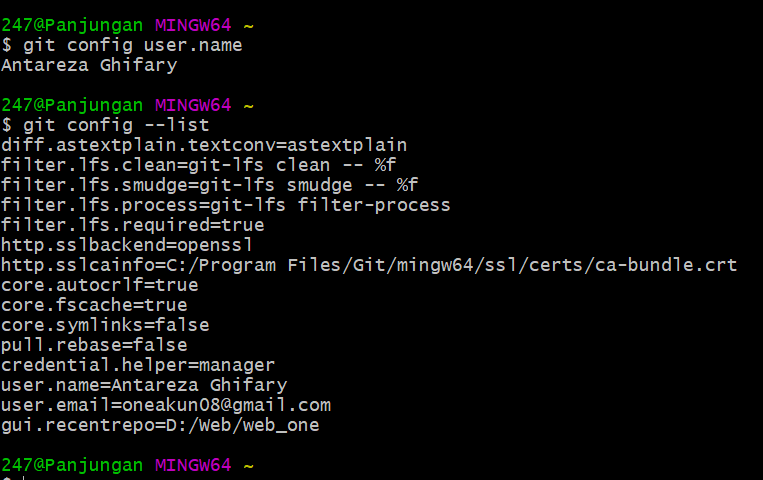

Isian di atas harus disesuaikan dengan nama serta email yang digunakan untuk mendaftar di GitHub. Untuk melihat konfigurasi yang sudah ada
Langkah ini cukup dilakukan sekali saja, kecuali jika ingin melakukan perubahan nama dan email.

Mengelola Repo Sendiri di Account Sendiri

Langkah-langkah Setiap orang yang telah mempunyai account di GitHub bisa membuat repo dengan. Secara umum, langkah-langkahnya adalah sebagai berikut:
a.Buat repo kosong di GitHub, bisa public maupun private. 
b.Cloe repo kosong tersebut di komputer lokal 
c.Perintah berikutnya terkait dengan perubahan repo serta sinkronisasi antara GitHub dengan lokal.

Membuat Repo Untuk membuat repo, gunakan langkah-langkan berikut: 

Klik tanda + pada bagian atas setelah login, pilih New repository

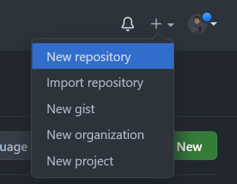

Isikan nama, keterangan, serta lisensi. Jika dikehendaki, bisa membuat repo Private

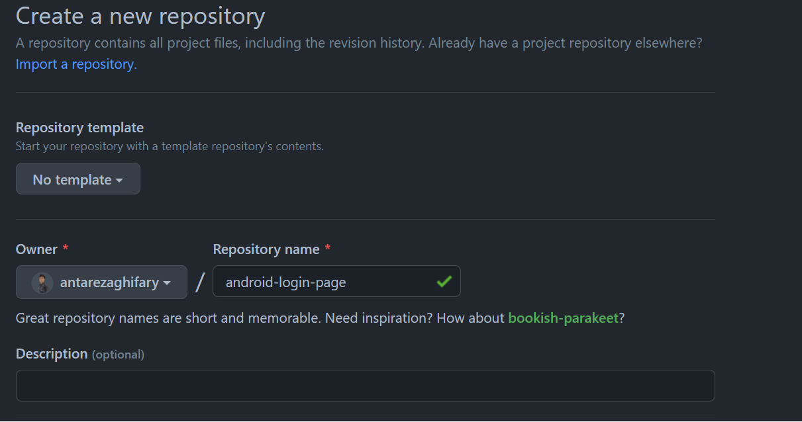

Klik Create Repository

Setelah langkah-langkah tersebut, repo akan dibuat dan bisa diakses menggunakan pola https://github.com/username/reponame. Pada repo tersebut, hanya akan muncul 1 file, yaitu LICENSE. Jika memilih membuat README pada saat langkah ke 2, juga akan muncul README.md. Ada atau tidak ada README.md tidak mempunyai efek apapun pada langkah ini.

Clone Repo 

Proses clone adalah proses untuk menduplikasikan remote repo di GitHub ke komputer lokal. Untuk melakukan proses clone, gunakan perintah berikut:

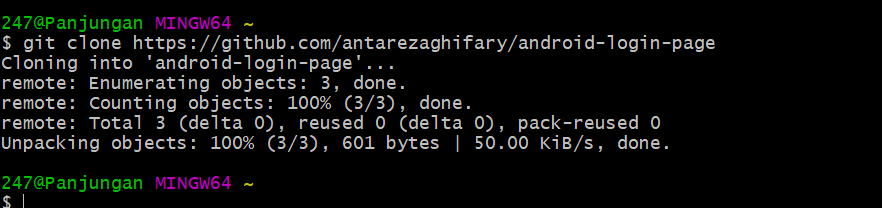

Setelah perintah ini, di direktori tekn-cloud-computing akan disimpan isi repo yang sama dengan di GitHub. Perbedaannya, di komputer lokal terdapat direktori .git yang digunakan secara internal oleh Git.

Mengelola Repo 
Setelah clone ke komputer lokal, semua manipulasi konten dilakukan di komputer lokal dan hasilnya akan di-push ke remote repo di GitHub. Dengan demikian, jangan bergantiganti remote lokal, sekali dibuat disitu, tetap berada disitu. Jika kehilangan repo lokal, clone ulang ke direktori yang bersih (kosong) setelah itu baru lakukan pengelolaan repo. Beberapa hal yang biasanya dilakukan akan diuraikan berikut ini. 
Mengubah Isi - Push Tanpa Branching dan Merging Perubahan isi bisa terjadi karena satu atau kombinasi beberapa hal berikut: 
a. File dihapus 
b. File diedit 
c. Membuat file / direktori baru 
d. Menghapus direktori 
Untuk kasus-kasus tersebut, lakukan perubahan di komputer lokal, setelah itu push 
ke repo.

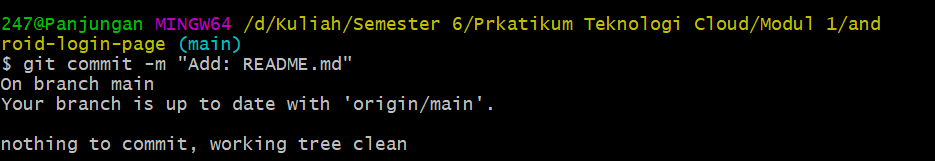

Vim README.md dari visual studio code

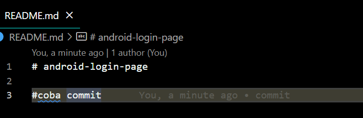
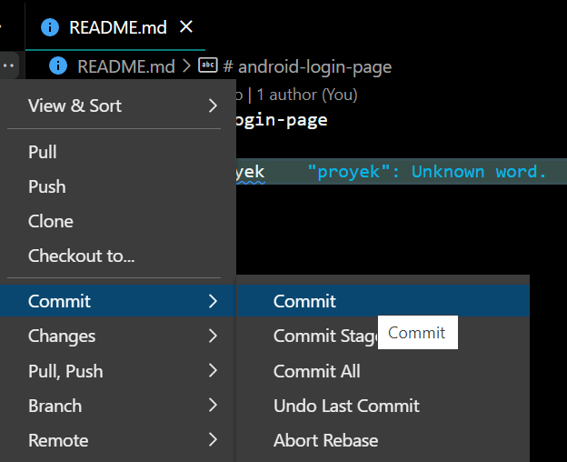
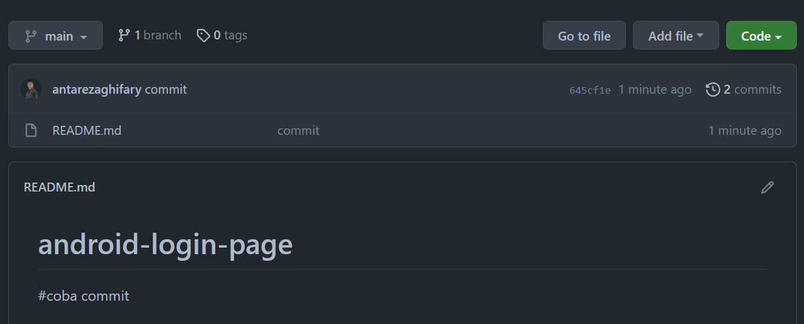

Check out edit-readme-1

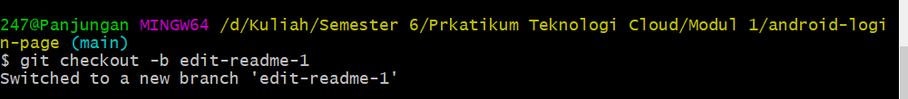

Push editan tadi

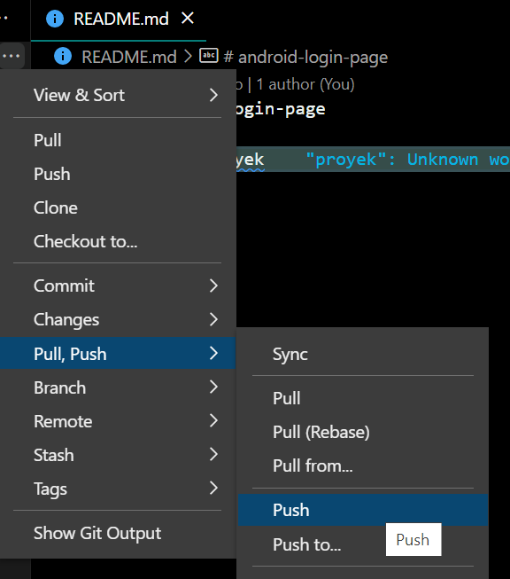

Setelah itu, kirim pull request (PR):

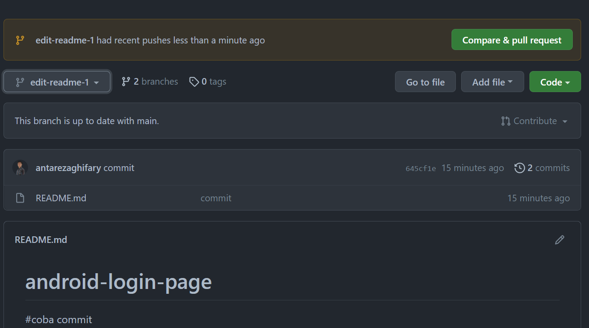

Setelah membuat PR, PR tersebut bisa di-merge:

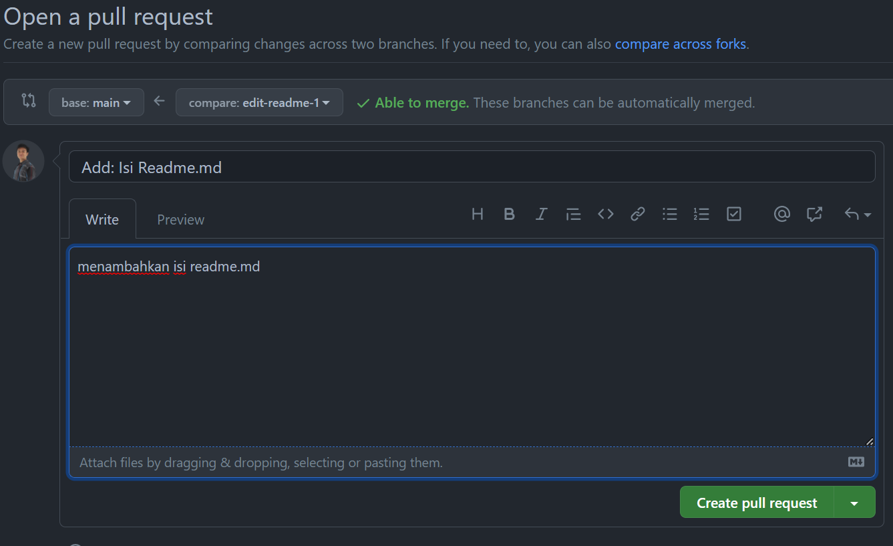
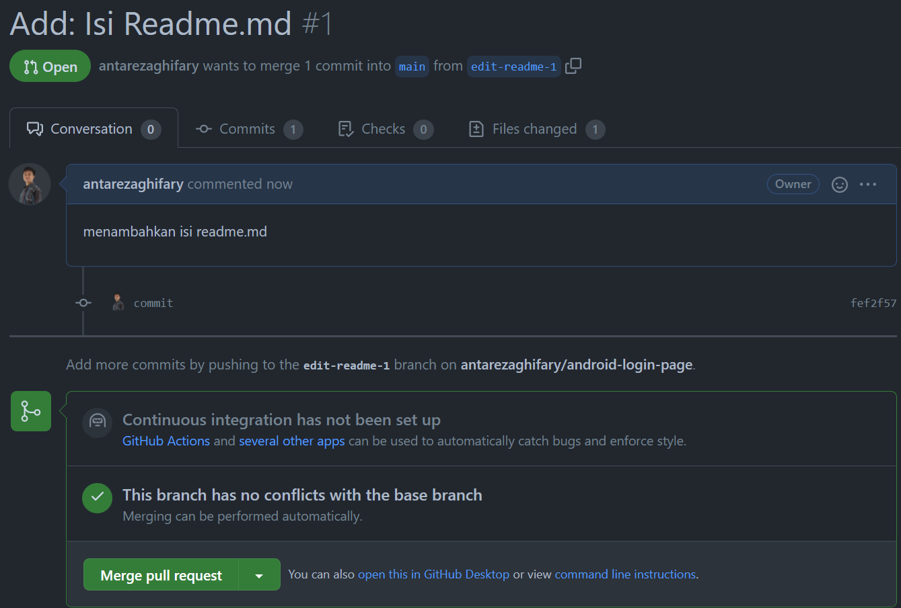
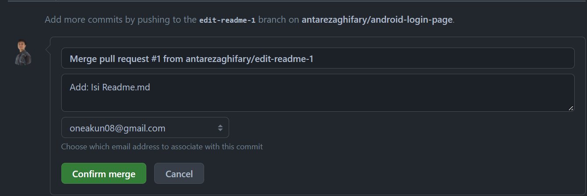
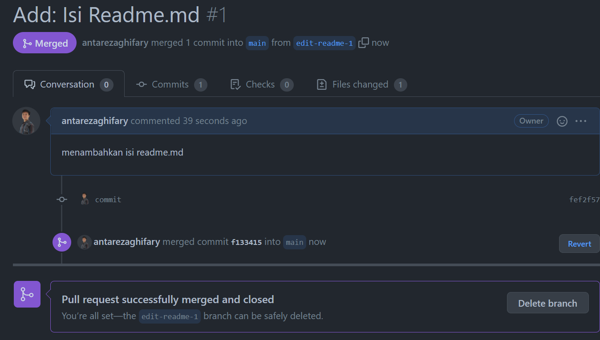
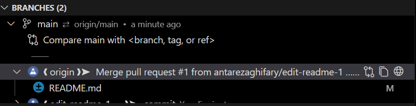

Mengelola Repo Sendiri di Organisasi

Repo yang dibuat bisa diletakkan pada account kita maupun berada pada suatu organisasi. Organisasi bisa kita buat sendiri maupun kita dimasukkan menjadi anggota organisasi. Pada dasarnya, bagian ini sama dengan bagian sebelumnya, hanya saja, pada saat membuat repo Owner dari repo adalah organisasi seperti berikut ini:

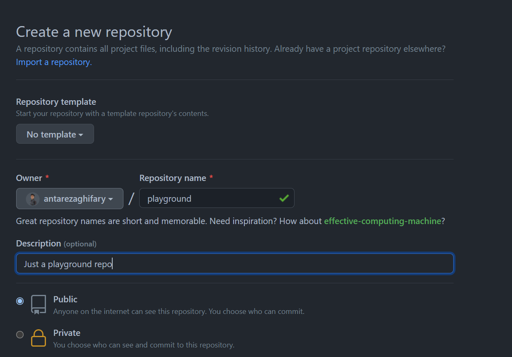

Git untuk Kolaborasi

Selain untuk mengelola aset digital milik diri sendiri, kita bisa menggunakan Git untuk berkolaborasi dalam suatu repo di GitHub yang bisa diakses bersama. Dalam kasus seperti ini, berarti ada 2 peran: Pemilik repo, sering disebut sebagai upstream author. Kontributor, yaitu orang-orang yang akan berkontribusi memberikan konten. Untuk situasi seperti ini, diasumsikan: Upstream author telah membuat repo git di GitHub Kontributor telah mengetahui adanya repo tersebut, tertarik untuk berkontribusi, sudah mengetahui apa yang akan diberikan ke proyek (repo GitHub upstream author) tersebut. Pembahasan selanjutnya adalah tentang bagaimana kontributor bisa mengirimkan kontribusi ke repo GitHub milik upstream author. Dalam pembahasan ini: Upstream author adalah oldstager. Kontributor adalah bpdp Repo dari upstream author adalah playground yang bisa diakses di https://github.com/AzharRivaldi/Sort-Filter_recyclerView

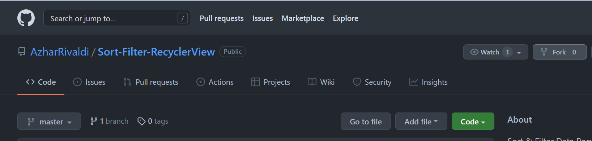

Fork 
Fork adalah membuat clone dari suatu repo di GitHub milik upstream author, diletakkan ke milik kontributor. Fork hanya dilakukan sekali saja. Pada dasarnya, proses untuk fork ini meliputi: Fork repo di web GitHub. Clone fork tersebut di komputer lokal.

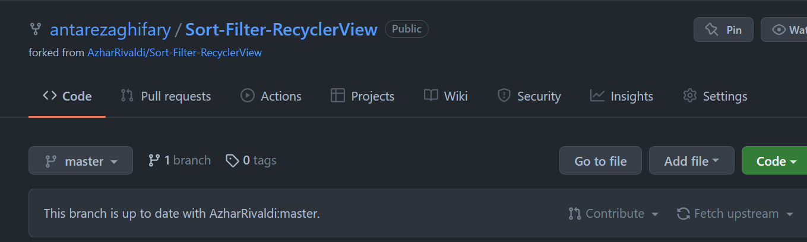

Setelah proses tersebut, clone di komputer lokal:

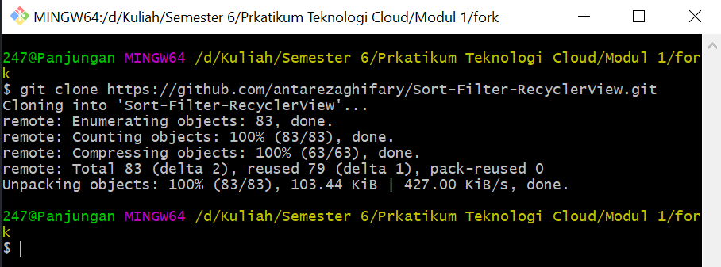

Repo origin sudah dituliskan konfigurasinya pada saat melakukan proses clone dari repo kontributor. Konfigurasi repo upstream harus dibuat.

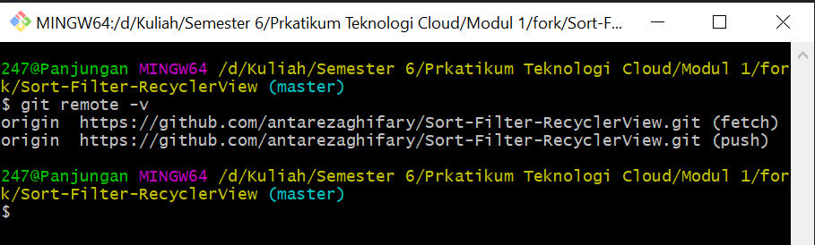

Tambahkan remote upstream:

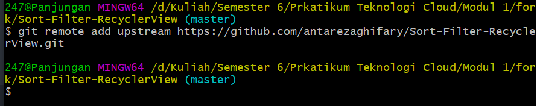

Hasil:

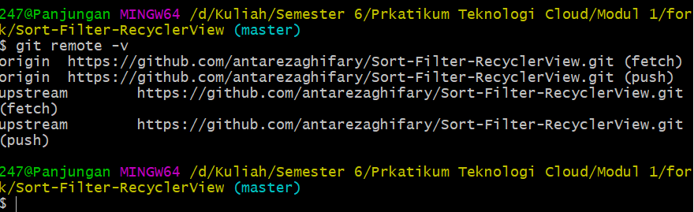

Membuat Perubahan di Repo Lokal Sebelum melakukan perubahan, pastikan: Sudah ada koordinasi secara manual tentang perubahan-perubahan yang akan dilakukan. Setelah melakukan perubahan-perubahan, pastikan bahwa isi repo lokal tersinkronisasi dengan repo dari upstream author. Cara melakukan sinkronisasi:

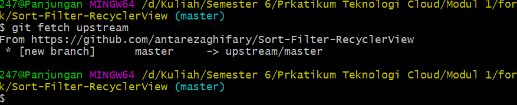

Lakukan perubahan-perubahan, setelah itu push ke origin (milik kontributor)

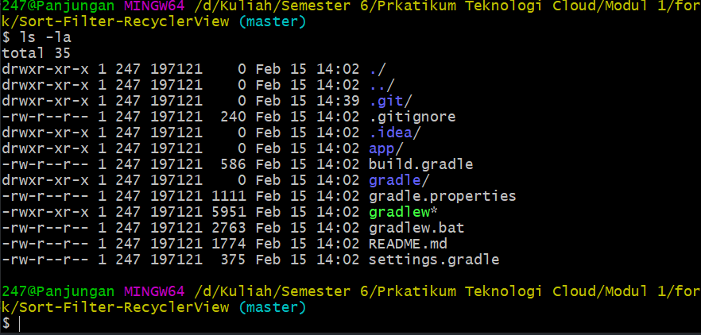
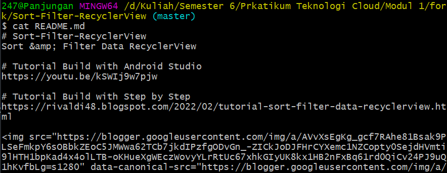
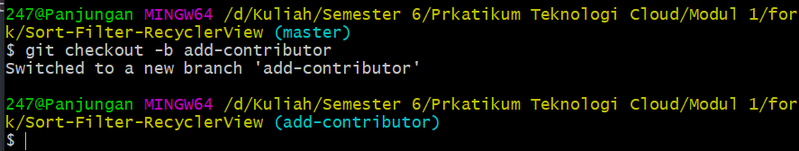
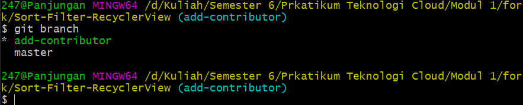
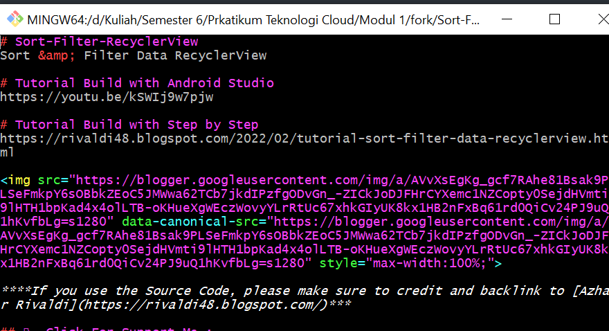
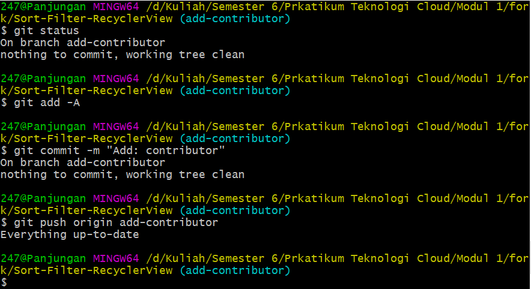
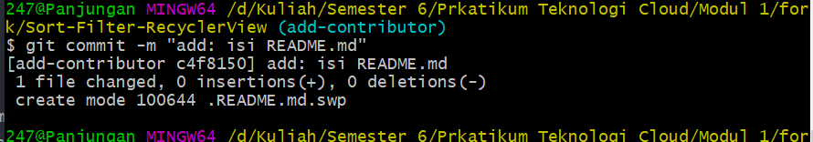


Setelah itu, buka halaman Web dari repo kontributor. Pada halaman tersebut akan ditampilkan isi yang kita push.


Pilih Compare and pull request, kemudian isikan deskripsi PR dan klik pada Create pull request:


