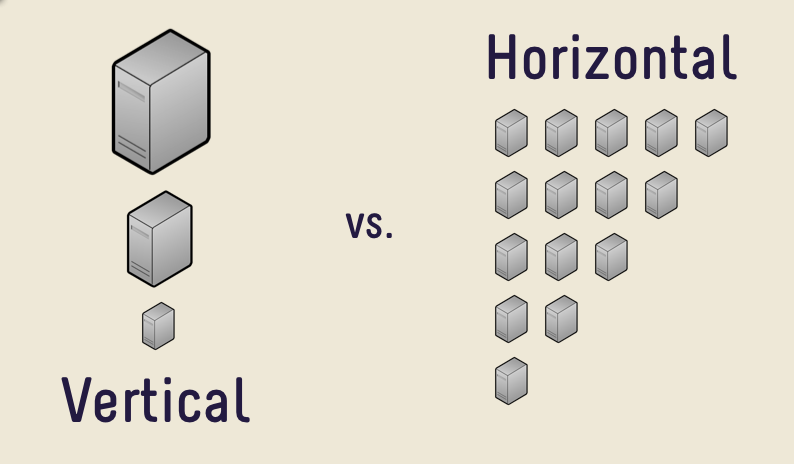

**Summary**
--

##### What is the difference between IaaS, SaaS, and Paas?

### **SaaS: Software as a Service**

It simply means running applications at public clouds. The user uses these apps via the Internet. These apps are maintained by the Service Provider. Some e.g., of Service Providers, are SalesForce, Microsoft(Office 365), Oracle, Google(Google Apps), etc.

Salesforce was the first company to transform the world of Saas, and from that point, other companies have seen potential in this market and launched their apps.

### **Iaas: Infrastructure as a Service**

It provides an environment for developers to build applications that users can use. IaaS includes:-

Users create virtual machines (VMs) on demand.
From a library of VM images.
Amazon (AWS) is a leading vendor in providing IaaS.

### **PaaS: Platform as a Service**

This is somewhat similar to IaaS but the difference is:

Developers provide an application which the platform runs.
They don’t directly create VMs.

### **SAAS (Software as a Service) Platform Architecture**

Software as a service is a software licensing and delivery model in which software is licensed on a subscription basis and is centrally hosted. Users can access it with the help of web browsers.

SaaS is a common delivery model for many business applications, including office and messaging software, management software,virtualization etc. It is part of the nomenclature of cloud computing, along with infrastructure as a service(IaaS), platform as a service(PaaS), desktop as a service(DaaS).

The SaaS provider hosts the application and data centrally — deploying patches . They upgrade to the application transparently, delivering access to end users over the Internet. Many vendors provide API’s that developers use for creating composite applications. It contains various security mechanisms for Data security during transmission and storage.

## **SAAS Architecture**

With this model, a single version of the application, with a single configuration is used for all customers. The application is installed on multiple machines to support scalability (called horizontal scaling). In some cases, a second version of the application is set up to offer a select group of customers with access to pre-release versions of the applications for testing purposes. In this traditional model, each version of the application is based on a unique code. Although an exception , some SaaS solutions do not use multitenancy, to cost-effectively manage a large number of customers in place. Whether multitenancy is a necessary component for software-as-a-service is a topic of controversy.

## **Benefit of SAAS**

It offers substantial opportunities for organizations of all sizes to shift the risks of software acquisition, and to move IT from a reactive cost center to being a proactive, value-producing part of the enterprise. Traditionally, deploying large-scale software systems has been a major undertaking. Deploying these systems across a large enterprise costs more. The time, staff, and budget requirements of a deployment of this magnitude represent a significant risk for an organization of any size, and often puts such software out of the reach of smaller organizations that would otherwise be able to derive from it a great deal of utility. The on-demand delivery model changes some of this. SaaS applications don’t require the deployment of a large infrastructure at the client’s location . This eliminates or drastically reduces the upfront commitment of resources.

## **Impact on IT Roles and Responsibilities**

Adding SaaS can cause a fundamental shift in the IT department’s role as a provider of information services. In the past, the nature of software deployment has put chief information officers in the role of gatekeepers . They could exercise a veto by declaring that they would not host it in the data center. With SaaS , control of the data center does not necessarily equal control over the entire enterprise-computing environment. This can cause the gatekeepers to fear a loss of control.

### **Software as a Service SaaS Platform Architecture**

## **What is a SaaS Platform?**

**Consumers**

From a consumer’s perspective, SaaS apps are one of the easiest and reliable ways to use digital services or products. You simply access them over the web, pay for the service, and use them. In recent years we’ve seen the emergence of thousands of SaaS applications services targeted at consumers such as:

Netflix
Microsoft Office 365
Amazon Prime
Twitter
Facebook
Google Docs
Salesforce

**Business**

From a business perspective, software products delivered “as a service” allows businesses to offer their products at scale, globally, whilst also allowing them to maintain overall control over their product.  Some of the other benefits of implementing SaaS architecture in the business include, but are not limited to:

Reduced time to market
Lower maintenance costs
Increased automation
Easier upgrades
More cost-effective
Single instance trials are viable as companies don’t need to commit many financial resources to try software.

## **Key Features and Benefits of a SaaS Platform**

**Simplicity**

Software applications architected as SaaS solutions are typically accessed over the web through various types of devices. Advancements in client-side programming languages such as JavaScript have resulted in more intuitive web interfaces and as such, make using applications delivered over the internet as easy to use as their desktop counterparts.

**Economical**

The monthly or annual subscript fee payment model makes it easier for businesses to budget, couple this with zero infrastructure setup costs, it’s easy to see how opting to use SaaS solutions can save the business money.

**Security**

Security is an important aspect of software development solutions and SaaS platforms are no different.  As a consumer of an application architected using SaaS, you don’t need to concern yourself with how your data is being locked down.  It’s held securely in the cloud!

**Compatibility**

With traditional software installations, updates and patches can occasionally require enormous amounts of time and money.  This is especially true in the enterprise.  Additionally, versioning discrepancies between team members of your workforce can lead to compatibility issues and even more wasted time. With SaaS, however, subscribers can simply log-on to already upgraded services.

## **Capabilities of SaaS Solutions**

SaaS platforms have a wide array of capabilities.  Especially when coupled with other cloud offerings such as IaaS (Infrastructure as a Service) and PaaS (Platform as a Service).

Cloud technology such as Microsoft Azure lets you provision servers that can host websites, databases, and much more.  Infrastructure that would have historically been physically installed on business premises and ran by internal IT teams, can now be provisioned from an online dashboard with just a few mouse clicks.

Office applications
Email and instant messaging
Social media
Fintech services
Exposing 3rd Party APIs
Security and authentication
Machine Learning
Artificial intelligence
Location Services
Data streaming and lookup services

--

##### How to build a cloud-based SaaS application

### **Build for the cloud**

When building a (global) SaaS application chances are high that you’re building it in the cloud. The cloud has a lot of advantages – think of scalability – in contrast to local server environments.

### **How to get started on your SaaS application?**
Which programming language, which database

### **Which programming language?**

Building a product for the cloud means building a product with a modern programming language.

Besides personal abilities and skills, the choice of your programming language will be influenced by the possibilities of each language. There are various (modern) programming languages out there making it a hard time to choose the right one.

Python is a widely used programming language, designed to emphasize on its code readability.

Python can do a lot of things. Whatever web app you’d like to build, there’s likely a framework for it in Python.

### **The perfect database for your SaaS application**

recommend making use of a document-oriented database. Document databases are quite different to the traditional concept of relational databases.

### **Why choose a document-oriented database?**

MongoDB

Why we choose MongoDB? Because MongoDB is a document-oriented database that provides high performance, high availability, and easy scalability. Yep. Besides performance (who wants a slow database?), scalability is the most important factor for us as a global SaaS business.

### **Queuing system for your SaaS application**

RabbitMQ
Again, I’d like to give you some insights on the queuing system we use. RabbitMQ is a great open source queuing system running on all major operating systems.

We run our web app in on the AWS EC2 where RabbitMQ can be run installed and run super smoothly.